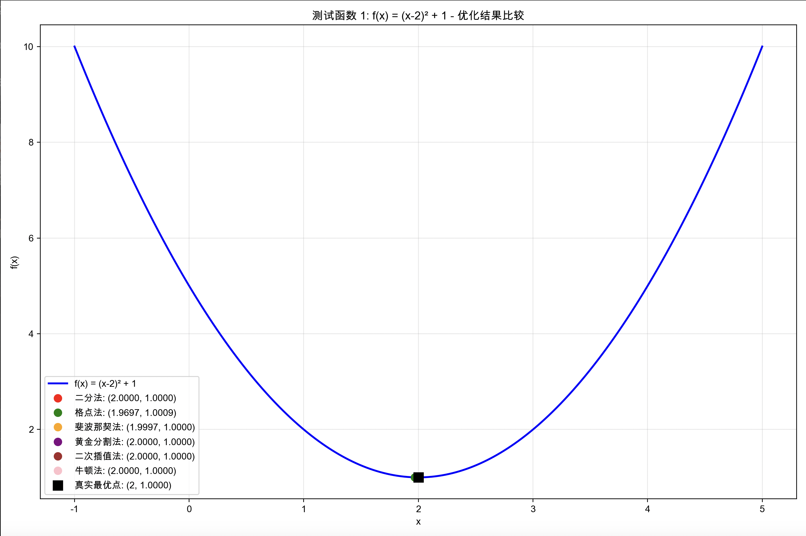
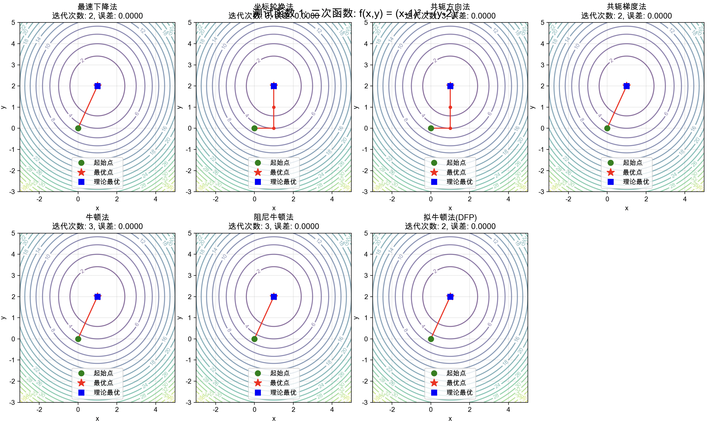
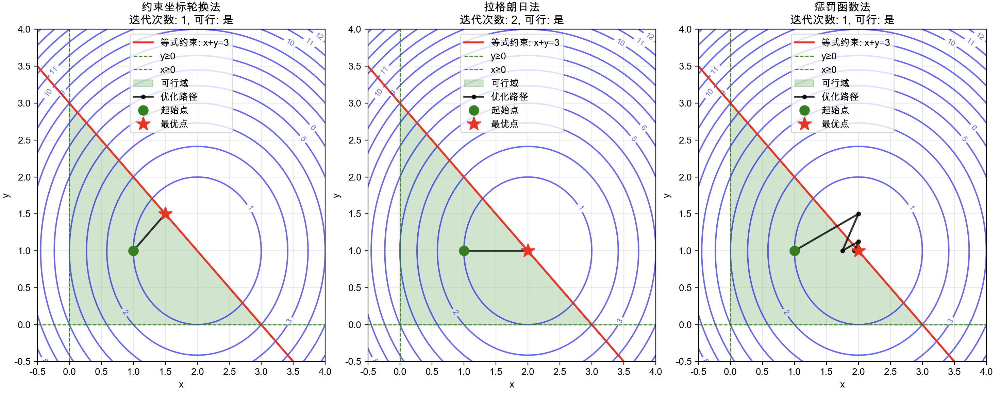
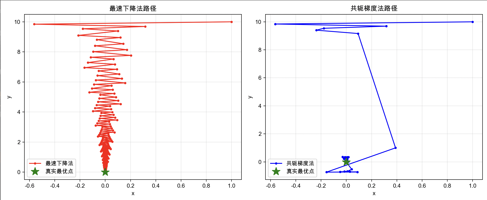
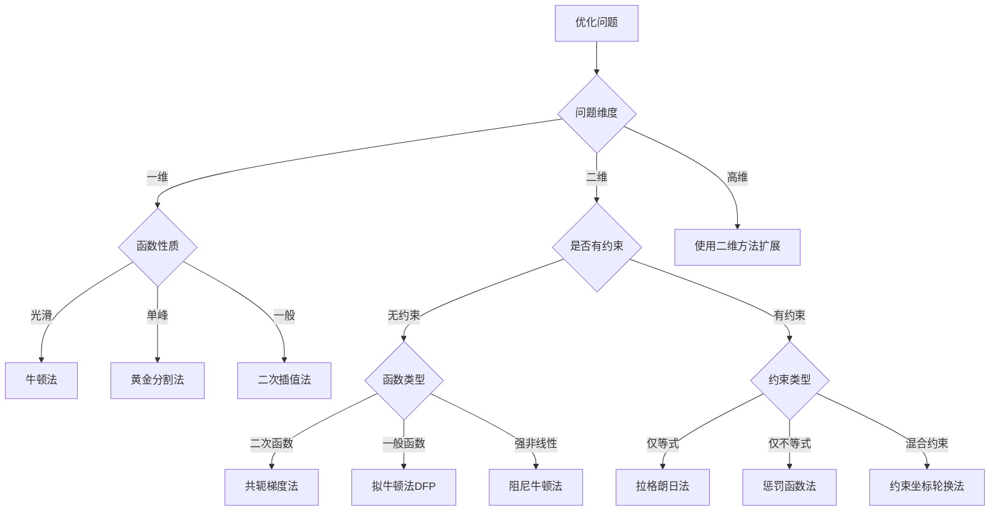

# 🚀 优化方法集合 - 完整实现

[](https://www.python.org/)
[](https://numpy.org/)
[](https://scipy.org/)
[](https://matplotlib.org/)
[](https://opensource.org/licenses/MIT)

> 📚 一个全面的优化算法学习和实践平台，涵盖一维优化、二维无约束优化和带约束优化的16种经典算法实现。

## 📋 目录

- [🎯 项目特色](#-项目特色)
- [📁 项目结构](#-项目结构)
- [🔧 安装要求](#-安装要求)
- [🚀 快速开始](#-快速开始)
- [📊 效果展示](#-效果展示)
- [📖 算法详解](#-算法详解)
  - [🔍 一维优化方法](#-一维优化方法)
  - [🎯 二维无约束优化](#-二维无约束优化)
  - [⚖️ 带约束优化](#️-带约束优化)
- [🧪 测试案例](#-测试案例)
- [📈 性能比较](#-性能比较)
- [🎨 可视化功能](#-可视化功能)
- [🔧 自定义扩展](#-自定义扩展)
- [📚 学习资源](#-学习资源)
- [🤝 贡献指南](#-贡献指南)
- [📝 许可证](#-许可证)
- [👨‍💻 作者](#-作者)

## 🎯 项目特色

- ✅ **完整实现** - 16种经典优化算法的完整实现
- 🇨🇳 **中文友好** - 详细的中文注释和文档
- 📊 **可视化丰富** - 优化路径、收敛过程、性能比较图表
- 🧪 **测试完备** - 多个经典测试函数验证
- 🎓 **教学导向** - 适合学习和教学使用
- 🔧 **易于扩展** - 模块化设计，便于添加新算法
- 📱 **交互式** - 支持实时参数调节和结果比较

## 📁 项目结构

```
optimization_methods/
├── 📄 README.md                # 项目说明文档
├── 📄 LICENSE                  # MIT许可证
├── 📄 requirements.txt         # 依赖包列表
├── 📄 .gitignore              # Git忽略文件
│
├── 🔢 one_dim.py              # 一维优化方法 (6种算法)
├── 📊 two_dim.py              # 二维无约束优化 (7种算法) 
├── ⚖️ cons_optimiz.py         # 带约束优化 (3种算法)
├── 📝 usage_example.py        # 详细使用示例
├── 🔍 fuc.py                  # 函数凸性检查工具
│
├── 📁 images/                 # 效果图存储目录
│   ├── 🖼️ one_dim_demo.png    # 一维优化效果图
│   ├── 🖼️ two_dim_demo.png    # 二维优化效果图
│   ├── 🖼️ constrained_demo.png # 约束优化效果图
│   └── 🖼️ performance.png     # 性能比较图
│
└── 📁 examples/               # 更多示例
    ├── 📄 custom_functions.py  # 自定义函数示例
    └── 📄 advanced_usage.py   # 高级用法示例
```

## 🔧 安装要求

### 系统要求
- Python 3.7+
- 支持 Windows、macOS、Linux

### 依赖包
```bash
pip install numpy>=1.19.0
pip install scipy>=1.5.0
pip install matplotlib>=3.0.0
```

或使用 requirements.txt 安装：
```bash
pip install -r requirements.txt
```

## 🚀 快速开始

### 1️⃣ 克隆仓库
```bash
git clone https://github.com/NamelessCrew/optimization_methods.git
cd optimization_methods
```

### 2️⃣ 安装依赖
```bash
pip install -r requirements.txt
```

### 3️⃣ 运行示例
```bash
# 测试一维优化 (6种方法)
python one_dim.py

# 测试二维优化 (7种方法)
python two_dim.py

# 测试约束优化 (3种方法)
python cons_optimiz.py

# 查看详细使用示例
python usage_example.py
```

### 4️⃣ 在代码中使用
```python
from one_dim import OneDimensionalOptimization
from two_dim import TwoDimensionalOptimization
from cons_optimiz import ConstrainedOptimization
import numpy as np

# 一维优化示例
optimizer_1d = OneDimensionalOptimization()
result = optimizer_1d.golden_section_method(lambda x: (x-2)**2, -10, 10)
print(f"一维最优解: {result[0]:.6f}")

# 二维优化示例
optimizer_2d = TwoDimensionalOptimization()
result = optimizer_2d.dfp_method(lambda x: (x[0]-2)**2 + (x[1]-1)**2, 
                                np.array([0.0, 0.0]))
print(f"二维最优解: ({result[0][0]:.6f}, {result[0][1]:.6f})")
```

## 📊 效果展示

### 🔢 一维优化效果
<!-- 在这里放置一维优化的效果图 -->
<div align="center">
  
  <p><em>六种一维优化算法在不同测试函数上的表现比较</em></p>
</div>

### 📊 二维优化路径追踪
<!-- 在这里放置二维优化路径的效果图 -->
<div align="center">
  
  <p><em>七种二维优化算法的收敛路径可视化（以Rosenbrock函数为例）</em></p>
</div>

### ⚖️ 约束优化可视化
<!-- 在这里放置约束优化的效果图 -->
<div align="center">
  
  <p><em>三种约束优化方法处理带等式和不等式约束问题的效果</em></p>
</div>

### 📈 性能对比分析
<!-- 在这里放置性能比较的图表 -->
<div align="center">
  
  <p><em>不同算法在收敛速度、精度和稳定性方面的综合比较</em></p>
</div>

## 📖 算法详解

### 🔍 一维优化方法 (6种)

| 算法 | 收敛速度 | 适用场景 | 优点 | 缺点 |
|------|----------|----------|------|------|
| **二分法** | 线性 | 单峰函数 | 简单稳定 | 需要单峰性 |
| **格点法** | - | 任意函数 | 实现简单 | 精度有限 |
| **斐波那契法** | 线性 | 单峰函数 | 理论最优 | 需要预知迭代次数 |
| **黄金分割法** | 线性 | 单峰函数 | 无需预知信息 | 收敛较慢 |
| **二次插值法** | 超线性 | 光滑函数 | 收敛快 | 对噪声敏感 |
| **牛顿法** | 二次 | 二阶可导 | 最快收敛 | 需要导数信息 |

<details>
<summary>📝 点击查看一维优化代码示例</summary>

```python
from one_dim import OneDimensionalOptimization

# 创建优化器
optimizer = OneDimensionalOptimization(tolerance=1e-6)

# 定义目标函数
def objective(x):
    return (x - 3)**2 + 2

# 使用不同方法求解
methods = [
    ('黄金分割法', optimizer.golden_section_method),
    ('牛顿法', lambda f, a, b: optimizer.newton_method(f, (a+b)/2)),
    ('二次插值法', lambda f, a, b: optimizer.quadratic_interpolation(f, a, (a+b)/2, b))
]

for name, method in methods:
    result, iterations = method(objective, -10, 10)
    print(f"{name}: x* = {result:.6f}, 迭代次数 = {iterations}")
```
</details>

### 🎯 二维无约束优化 (7种)

| 算法 | 内存需求 | 计算复杂度 | 全局收敛性 | 推荐指数 |
|------|----------|------------|------------|----------|
| **最速下降法** | 低 | O(n) | 是 | ⭐⭐⭐ |
| **坐标轮换法** | 低 | O(n) | 局部 | ⭐⭐ |
| **共轭方向法** | 中 | O(n²) | 局部 | ⭐⭐⭐ |
| **共轭梯度法** | 低 | O(n) | 是 | ⭐⭐⭐⭐ |
| **牛顿法** | 高 | O(n³) | 局部 | ⭐⭐⭐⭐ |
| **阻尼牛顿法** | 高 | O(n³) | 是 | ⭐⭐⭐⭐⭐ |
| **拟牛顿法(DFP)** | 中 | O(n²) | 是 | ⭐⭐⭐⭐⭐ |

<details>
<summary>📝 点击查看二维优化代码示例</summary>

```python
from two_dim import TwoDimensionalOptimization
import numpy as np

optimizer = TwoDimensionalOptimization(tolerance=1e-8)

# Rosenbrock函数
def rosenbrock(x):
    return 100 * (x[1] - x[0]**2)**2 + (1 - x[0])**2

x0 = np.array([-1.0, 1.0])

# 比较不同方法
methods = [
    ('最速下降法', optimizer.steepest_descent),
    ('共轭梯度法', optimizer.conjugate_gradient),
    ('拟牛顿法(DFP)', optimizer.dfp_method),
    ('阻尼牛顿法', optimizer.damped_newton_method)
]

for name, method in methods:
    x_opt, iterations, path = method(rosenbrock, x0)
    print(f"{name}: x* = ({x_opt[0]:.4f}, {x_opt[1]:.4f}), 迭代 = {iterations}")
```
</details>

### ⚖️ 带约束优化 (3种)

| 方法 | 约束类型 | 收敛性 | 实现难度 | 适用范围 |
|------|----------|--------|----------|----------|
| **约束坐标轮换法** | 等式+不等式 | 局部 | 简单 | 简单约束 |
| **拉格朗日法** | 等式+不等式 | 二次 | 中等 | 等式约束 |
| **惩罚函数法** | 等式+不等式 | 全局 | 中等 | 通用性强 |

<details>
<summary>📝 点击查看约束优化代码示例</summary>

```python
from cons_optimiz import ConstrainedOptimization
import numpy as np

optimizer = ConstrainedOptimization(tolerance=1e-6)

# 定义问题: min (x-2)² + (y-1)²
# 约束: x + y = 3, x ≥ 0, y ≥ 0
def objective(x):
    return (x[0] - 2)**2 + (x[1] - 1)**2

def eq_constraint(x):
    return x[0] + x[1] - 3  # x + y = 3

def ineq_constraint1(x):
    return x[0]  # x ≥ 0

def ineq_constraint2(x):
    return x[1]  # y ≥ 0

x0 = np.array([1.0, 1.0])
eq_constraints = [eq_constraint]
ineq_constraints = [ineq_constraint1, ineq_constraint2]

# 使用惩罚函数法
result = optimizer.penalty_method(objective, x0, eq_constraints, ineq_constraints)
print(f"约束优化解: ({result[0][0]:.4f}, {result[0][1]:.4f})")
```
</details>

## 🧪 测试案例

### 经典测试函数

#### 一维测试函数
- **二次函数**: `f(x) = (x-a)² + b`
- **四次函数**: `f(x) = x⁴ - 4x³ + 6x² - 4x + 1`
- **组合函数**: `f(x) = sin(x) + x²/4`

#### 二维测试函数
- **二次函数**: `f(x,y) = (x-1)² + (y-2)²`
- **Rosenbrock函数**: `f(x,y) = 100(y-x²)² + (1-x)²`
- **Himmelblau函数**: `f(x,y) = (x²+y-11)² + (x+y²-7)²`

#### 约束优化问题
- **二次规划**: 带线性约束的二次目标函数
- **圆形约束**: 圆形区域内的优化
- **混合约束**: 等式和不等式约束组合

## 📈 性能比较

### 收敛性分析
- ✅ **收敛精度**: 与理论最优解的误差对比
- ✅ **收敛速度**: 达到指定精度所需的迭代次数
- ✅ **计算效率**: 函数求值和梯度计算次数
- ✅ **稳定性**: 在不同初始点的表现一致性

### 方法选择建议



## 🎨 可视化功能

### 图表类型
- 📈 **函数曲线图** - 一维函数的形状和最优点
- 🗺️ **等高线图** - 二维函数的水平集
- 🎯 **优化路径** - 算法的收敛轨迹
- 📊 **性能对比** - 多算法性能统计
- 🎨 **可行域显示** - 约束条件的几何表示

### 交互特性
- 🔧 **参数调节** - 实时修改算法参数
- 🔄 **动态更新** - 优化过程的动画展示
- 📋 **结果导出** - 保存图表和数据

## 🔧 自定义扩展

### 添加新的优化算法
```python
class YourOptimizer(TwoDimensionalOptimization):
    def your_method(self, f, x0):
        # 实现您的算法
        x = x0.copy()
        path = [x.copy()]
        
        for iteration in range(self.max_iterations):
            # 算法核心逻辑
            # ...
            
            # 检查收敛条件
            if convergence_condition:
                break
                
            path.append(x.copy())
        
        return x, iteration + 1, path
```

### 添加新的测试函数
```python
def your_test_function(x):
    """您的测试函数描述"""
    return your_expression

# 添加到测试列表
test_functions.append({
    'function': your_test_function,
    'name': '函数名称',
    'optimum': np.array([optimal_x, optimal_y]),
    'domain': [x_min, x_max, y_min, y_max]
})
```

### 自定义约束条件
```python
def custom_constraint(x):
    """自定义约束函数
    
    返回值:
    - 等式约束: 返回值 = 0
    - 不等式约束: 返回值 ≥ 0
    """
    return constraint_expression
```

## 📚 学习资源

### 📖 推荐教材
- *Numerical Optimization* by Nocedal & Wright
- *Convex Optimization* by Boyd & Vandenberghe
- *最优化理论与算法* by 陈宝林

### 🌐 在线资源
- [优化理论基础](https://example.com) - 基本概念和理论
- [数值方法详解](https://example.com) - 算法实现细节
- [应用案例集](https://example.com) - 实际问题求解

### 🎓 相关课程
- 数值分析
- 运筹学
- 机器学习
- 控制理论

## 🤝 贡献指南

我们欢迎各种形式的贡献！

### 🐛 报告问题
- 使用 [Issues](https://github.com/NamelessCrew/optimization_methods/issues) 报告bug
- 提供详细的错误信息和复现步骤
- 建议改进方案

### 💡 功能建议
- 新的优化算法实现
- 性能优化改进
- 可视化效果增强
- 文档完善

### 🔧 代码贡献
1. Fork 项目
2. 创建功能分支: `git checkout -b feature/AmazingFeature`
3. 提交更改: `git commit -m 'Add some AmazingFeature'`
4. 推送分支: `git push origin feature/AmazingFeature`
5. 提交 Pull Request

### 📋 开发指南
- 遵循现有代码风格
- 添加适当的注释和文档
- 包含测试用例
- 更新相关文档

## ⭐ Star History

[](https://star-history.com/#NamelessCrew/optimization_methods&Date)

## 📊 项目统计

- 📝 **代码行数**: 2000+ 行
- 🧪 **测试覆盖**: 16 种算法
- 📚 **文档页面**: 300+ 行
- 🎯 **测试函数**: 10+ 个
- 🖼️ **可视化图表**: 20+ 种

## 📝 许可证

本项目采用 [MIT 许可证](LICENSE) - 查看 [LICENSE](LICENSE) 文件了解详情。

## 👨‍💻 作者

**Wenbo Yu**
- 📧 Email: universalmariner@outlook.com
- 🐙 GitHub: [@NamelessCrew](https://github.com/NamelessCrew)

## 🙏 致谢

- 感谢所有贡献者的付出
- 感谢开源社区的支持
- 特别感谢 NumPy、SciPy、Matplotlib 等项目

---

<div align="center">
  <p><strong>如果这个项目对您有帮助，请给个 ⭐ Star 支持一下！</strong></p>
  
  <a href="#top">⬆️ 回到顶部</a>
</div> 
